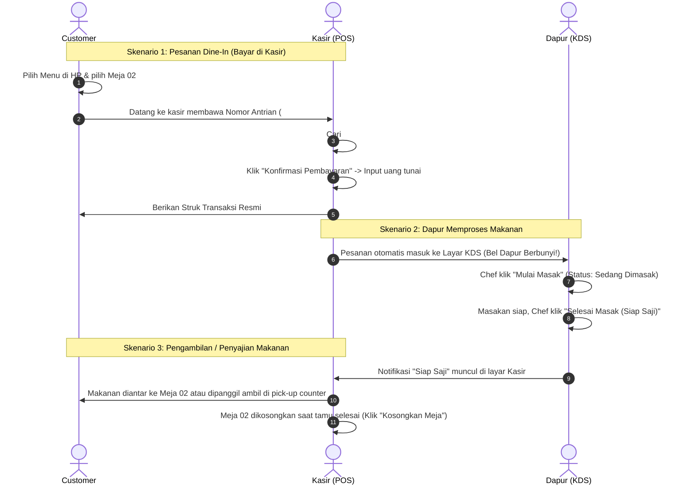

# 📋 LAPORAN FUNGSI, ROLE & PANDUAN PENGGUNAAN SISTEM
## Sistem Pemesanan, Kasir POS & Kitchen Display System (KDS) — Mie Gacoan

---

## 1. RINGKASAN SISTEM

Sistem **Mie Gacoan POS & Online Ordering** adalah aplikasi operasional restoran modern yang menghubungkan pelanggan (*Customer*), petugas kasir (*Cashier POS*), juru masak dapur (*Kitchen KDS*), dan pengelola (*Admin/Owner*) secara terintegrasi dan *real-time*.

### 🌐 Link Akses Sistem (Live Deployment):
- **Customer Web (Portal Pemesanan)**: [https://gacoan-ten.vercel.app/](https://gacoan-ten.vercel.app/)
- **Portal Kasir POS**: [https://gacoan-ten.vercel.app/kasir.html](https://gacoan-ten.vercel.app/kasir.html)
- **Portal Dapur (KDS)**: [https://gacoan-ten.vercel.app/dapur.html](https://gacoan-ten.vercel.app/dapur.html)
- **Portal Admin (Owner)**: [https://gacoan-ten.vercel.app/admin.html](https://gacoan-ten.vercel.app/admin.html)

*(Untuk pengujian lokal: ganti `https://gacoan-ten.vercel.app/` dengan `http://localhost:3000/`)*

---

## 2. DAFTAR ROLE & HAK AKSES (ACCESS CONTROL)

| Role | Target Pengguna | Akses Halaman | Kredensial Login (Email / Username) | Password |
| :--- | :--- | :--- | :--- | :--- |
| **Customer (Pelanggan)** | Pembeli Dine-In, Take Away, & Tamu Reservasi | `index.html` | Langsung akses (tanpa login) atau login akun personal | Bebas (saat daftar) |
| **Kasir (POS Cashier)** | Petugas Kasir / Front Office | `kasir.html` | `kasir@gacoan.com` / `kasir` | `kasir123` |
| **Dapur (Kitchen KDS)** | Chef & Barista Dapur | `dapur.html` | `dapur@gacoan.com` / `dapur` | `dapur123` |
| **Admin (Owner/Manager)**| Store Manager & Administrator | `admin.html` | `admin@gacoan.com` / `admin` | `admin123` |

---

## 3. RINCIAN FUNGSI & FITUR TIAP ROLE

### 👤 1. ROLE CUSTOMER (PELANGGAN)
Halaman: `index.html`

- **Katalog Menu Interaktif**:
  - Filter kategori menu: `MIE`, `DIMSUM`, `BEVERAGE`, `MIRAS`.
  - Pencarian menu instan berdasarkan nama atau deskripsi.
  - Pemilihan tingkat kepedasan mie (**Level 0 s/d Level 8**) dengan penyesuaian harga otomatis.
  - Penambahan catatan khusus (misal: "tidak pakai bawang daun", "es sedikit").
- **Keranjang Belanja (Cart) Modern**:
  - Dok bar keranjang dinamis di bagian bawah layar.
  - Perhitungan subtotal, pajak PB1 10%, dan grand total otomatis.
- **Pilihan Tipe Layanan**:
  1. **Dine In (Makan di Tempat)**: Memilih nomor meja (Meja 01 - 12).
  2. **Take Away (Bungkus)**: Pesanan dikemas untuk dibawa pulang.
  3. **Reservasi Meja & Booking Acara**: Memilih tanggal, jam kedatangan, nomor meja, jumlah tamu/kursi, dan pembayaran uang muka (DP 50% atau Lunas 100%).
- **Metode Pembayaran Mandiri**:
  - QRIS / Payment Gateway Midtrans Snap (GoPay, ShopeePay, Transfer Bank, dll).
  - Bayar Tunai di Kasir.
- **Struk Digital & Bukti Antrian**:
  - Mendapatkan nomor antrian harian (misal: `#A-001`).
  - QR Code digital yang dapat di-scan oleh kasir.
  - Tombol simpan/unduh struk pesanan.

---

### 💳 2. ROLE KASIR (POS CASHIER)
Halaman: `kasir.html`

- **Dashboard Antrian & Transaksi**:
  - Ringkasan KPI Harian: *Total Pesanan, Menunggu Bayar, Sudah Lunas, dan Total Omset Harian*.
  - **Filter Tanggal Fleksibel**:
    - `[ 📅 Hari Ini ]`: Menampilkan hanya pesanan operasional hari ini.
    - `[ 📆 Pilih Tanggal ]`: Memilih tanggal kalender bebas (misal: melihat pesanan kemarin, 2 hari lalu, dsb).
    - `[ 📋 Semua Riwayat ]`: Menampilkan seluruh riwayat pesanan yang pernah ada.
  - Filter status pesanan: Semua, Menunggu Bayar, Sudah Lunas, Selesai.
  - Pencarian cepat nomor antrian atau nama pelanggan.
  - Scan Barcode/QR struk pelanggan via kamera atau input kode QR manual.
- **Penyelesaian Transaksi Tunai (Cash Payment)**:
  - Modal pembayaran tunai dengan tombol nominal cepat (*Uang Pas, 20rb, 50rb, 100rb*).
  - Perhitungan kembalian otomatis dan validasi uang kurang.
- **Denah Meja (Live Table Map)**:
  - Visualisasi 12 Meja secara real-time:
    - 🟢 **Hijau (Kosong / Tersedia)**
    - 🔴 **Merah (Sedang Terisi Tamu Makan)**
    - 🟡 **Kuning (Ada Jadwal Reservasi)**
  - Tombol **`+ Pesan Meja Ini`**: Kasir bisa langsung membuat pesanan Dine-In untuk tamu yang baru duduk.
  - Tombol **`Reservasi`**: Kasir bisa langsung mem-booking reservasi meja untuk tamu.
  - Tombol **`Kosongkan Meja`**: Menandai meja kembali bersih dan siap dipakai tamu baru.
  - **Filter Tanggal Denah Meja**: Memantau okupansi meja pada tanggal berjalan atau tanggal reservasi mendatang.
- **Manajemen Reservasi & Booking Acara**:
  - Konfirmasi Tamu Datang (Check-In) ketika tamu reservasi tiba di outlet.
  - Modal Pelunasan Sisa Tagihan (dari DP 50% menjadi 100% LUNAS).
  - Cetak struk bukti reservasi resmi.
- **Katalog Menu Kasir**: Cek stok dan harga resmi menu secara cepat.
- **Data Penjualan & Laporan Keuangan**:
  - Laporan penjualan Harian, Bulanan, dan Tahunan.
  - Daftar menu terlaris (*Top Selling Items*).
  - Riwayat lengkap transaksi dengan cetak ulang struk.
  - **Ekspor Laporan ke CSV/Excel** dengan satu klik.

---

### 🍳 3. ROLE DAPUR (KITCHEN DISPLAY SYSTEM - KDS)
Halaman: `dapur.html`

- **Layar Antrian Masak Digital**:
  - Pesanan yang sudah berstatus LUNAS atau tamu reservasi yang sudah CHECK-IN otomatis masuk ke layar dapur.
  - Pesanan kemarin yang sudah selesai otomatis terfilter sehingga dapur fokus pada pesanan hari ini.
- **Notifikasi Suara Bel (Kitchen Bell Audio)**:
  - Menggunakan *Web Audio API* yang membunyikan lonceng (*double bell ring*) otomatis setiap kali ada pesanan baru yang dibayar.
- **Status Alur Memasak**:
  - `BARU MASUK`: Pesanan baru tiba, perlu segera disiapkan chef.
  - `SEDANG DIMASAK`: Tombol **"Mulai Masak"** untuk mengubah status pesanan.
  - `SIAP SAJI`: Tombol **"Selesai Masak (Siap Saji)"** saat makanan siap diambil pelayan/kasir.
- **Rincian Tiket Masak**:
  - Daftar menu, porsi (qty), level pedas, dan catatan khusus pelanggan (misal: "tanpa saus").
  - Checklist item per masakan untuk memastikan tidak ada item yang terlewat.
  - Indikator Meja Dine-In atau Bungkus Take Away.

---

### 👑 4. ROLE ADMIN (STORE MANAGER / OWNER)
Halaman: `admin.html`

- **Dashboard Eksekutif**:
  - Total omset keseluruhan restoran.
  - Total pesanan lunas dan porsi makanan yang terjual.
  - Jumlah menu aktif dan kategori.
- **Manajemen Menu & Stok Produk**:
  - Tambah menu baru lengkap dengan foto, nama, kategori, harga, deskripsi, dan varian level pedas.
  - Edit data menu dan harga jual.
  - Toggle status stok (**Tersedia / Habis**) secara instan.
  - Hapus menu yang sudah tidak dijual.
- **Manajemen Kategori**:
  - Tambah dan kelola kategori produk (*MIE, DIMSUM, BEVERAGE, MIRAS, dll*).
- **Monitoring Seluruh Reservasi**:
  - Melihat seluruh data booking acara pelanggan.
- **Monitoring Data Penjualan**:
  - Akses riwayat seluruh transaksi restoran untuk keperluan audit dan pembukuan.

---

## 4. TUTORIAL LANGKAH DEMI LANGKAH (CARA AKSES & LOGIN)

### 🚀 Cara Cepat Masuk dari Halaman Utama (`index.html`)
Di halaman utama web, klik tombol **"Masuk / Akun"** di pojok kanan atas:
- Masukkan email `admin@gacoan.com` + password `admin123` ➔ **Otomatis diarahkan ke Portal Admin**.
- Masukkan email `kasir@gacoan.com` + password `kasir123` ➔ **Otomatis diarahkan ke Portal Kasir POS**.
- Masukkan email `dapur@gacoan.com` + password `dapur123` ➔ **Otomatis diarahkan ke Portal Dapur KDS**.

---

### A. Tutorial Masuk ke Portal Kasir POS
1. Buka browser dan akses URL: **`https://gacoan-ten.vercel.app/kasir.html`**
2. Layar login Kasir akan muncul jika sesi belum aktif.
3. Masukkan:
   - **Username / Email**: `kasir@gacoan.com` (atau ketik: `kasir`)
   - **Password**: `kasir123`
4. Klik tombol **"Masuk ke Portal Kasir"**.
5. Sistem akan membuka dashboard POS lengkap dengan antrian hari ini, denah meja live, dan data penjualan.

---

### B. Tutorial Masuk ke Portal Dapur (Kitchen KDS)
1. Buka browser dan akses URL: **`https://gacoan-ten.vercel.app/dapur.html`**
2. Layar login Kitchen akan muncul jika sesi belum aktif.
3. Masukkan:
   - **Email**: `dapur@gacoan.com` (atau ketik: `dapur`)
   - **Password**: `dapur123`
4. Klik tombol **"Masuk ke Layar Dapur"**.
5. Layar KDS akan terbuka. Klik di area layar sekali untuk mengaktifkan izin audio notifikasi bel lonceng.

---

### C. Tutorial Masuk ke Portal Admin (Store Manager)
1. Buka browser dan akses URL: **`https://gacoan-ten.vercel.app/admin.html`**
2. Layar login Admin akan muncul jika sesi belum aktif.
3. Masukkan:
   - **Email**: `admin@gacoan.com` (atau ketik: `admin`)
   - **Password**: `admin123`
4. Klik tombol **"Masuk ke Dashboard Admin"**.
5. Dashboard manajemen resto, pengelolaan menu, dan kontrol stok siap digunakan.

---

### D. Tutorial Pemesanan oleh Customer (Pelanggan)
1. Buka URL: **`https://gacoan-ten.vercel.app/`** (atau scan QR meja resto).
2. Pilih menu yang diinginkan (contoh: *Mie Gacoan Level 2*, *Udang Keju*, *Es Gobak Sodor*).
3. Klik tombol **"+ Tambah"**.
4. Klik dok **"Keranjang Belanja"** di bagian bawah.
5. Pilih tipe pesanan:
   - Jika **Dine In**: Pilih nomor meja tempat Anda duduk (misal: *Meja 02*).
   - Jika **Take Away**: Pilih opsi bawa pulang.
   - Jika **Reservasi**: Tentukan tanggal, jam, dan nomor meja acara.
6. Masukkan nama pemesan dan nomor WhatsApp.
7. Pilih metode bayar:
   - **QRIS / Online**: Langsung scan kode QRIS Midtrans dari ponsel.
   - **Tunai di Kasir**: Langsung menuju kasir dan sebutkan nomor antrian Anda.
8. Setelah bayar, struk pesanan digital akan muncul dengan nomor antrian Anda.

---

## 5. ALUR KERJA OPERASIONAL (END-TO-END WORKFLOW)

---

## 6. FITUR TERBARU (UPDATE SYSTEM)

1. **Pemisahan Antrian Hari Ini vs Riwayat**:
   - Secara default, kasir dan dapur hanya menampilkan pesanan tanggal berjalan (*Hari Ini*), mencegah antrian lama menumpuk.
2. **Pemilih Tanggal Kalender Bebas (Date Picker)**:
   - Tersedia di tab **Antrian & Transaksi**, **Denah Meja (Live)**, dan **Jadwal Reservasi**.
   - Kasir dapat memilih tanggal berapa pun untuk memeriksa riwayat pesanan, jadwal booking meja, atau omset pada tanggal tertentu.
3. **Pesan Meja Langsung dari Denah Kasir**:
   - Kasir cukup mengklik tombol **`+ Pesan Meja Ini`** pada denah meja kosong untuk langsung membuat pesanan Dine-In tamu walk-in.
4. **Perhitungan Omset & Ekspor CSV**:
   - Data laporan penjualan dapat difilter harian, bulanan, tahunan dan diekspor ke format Excel/CSV kapan saja.
